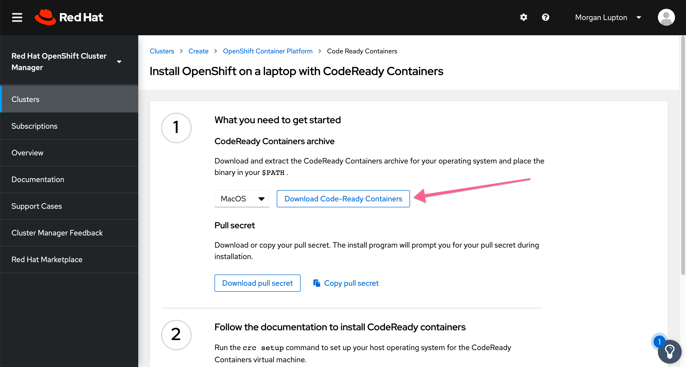

# operator-example-with-everything
## Datadog Operator Example that Includes Kubernetes, Docker, Logs, Process, NPM, APM, Control Plane, and OpenShift Metrics

This guide explains the installation process behind configuring every possible integration you may want to configure with the Operator. Included in this repository are instructions on how to deploy a local OpenShift cluster (v4+) as well as configure the Datadog agent along with all relevant integrations. 

Inspiration came from [Ryan Hennessy's guide that you can find here](https://github.com/ryhennessy/datadog-operator-openshift-example). 

### Configuring `crc` to work on your local machine

1. Navigate to [Red Hat's CodeReady Containers product page](https://cloud.redhat.com/openshift/install/crc/installer-provisioned?intcmp=7013a000002CtetAAC). You will need to create a Red Hat account in order to access the page. 

2. Once logged in, download the CodeReady Containers tarball archive. Keep this page open, because you'll need the pull secret later on. 



3. Extract the archive and place the contents in a location that you can easily add to your `$PATH`. I extracted to `/usr/local/share/` using the following command. 

```
[morgan.lupton@mycomputer:~/Downloads]$ tar -xvf crc-macos-amd64.tar.xz -C /usr/local/share/
```

4. Add the path to the `crc` executable to your `$PATH` env var. Please keep in mind that the path name will depend on the version of crc you downloaded (in this case 1.14.0). 

```
[morgan.lupton@mycomputer:~]$ export PATH="/usr/local/share/crc-macos-1.14.0-amd64/:$PATH"
```

5. Make sure to add this statement to your bash profile such that it persists after you exit out of the terminal. 

```
[morgan.lupton@mycomputer:~]$ vim ~/.bash_profile
```

Simply add this line to the bottom of the file. 
```
...
export PATH="/usr/local/share/crc-macos-1.14.0-amd64/:$PATH"
```

6. Run the `crc setup` command. You will be prompted for your password. 

```
[morgan.lupton@COMP10906:~]$ crc setup
INFO Checking if oc binary is cached
INFO Caching oc binary
INFO Checking if podman remote binary is cached
INFO Checking if goodhosts binary is cached
INFO Caching goodhosts binary
INFO Will use root access: change ownership of /Users/morgan.lupton/.crc/bin/goodhosts
Password:
INFO Will use root access: set suid for /Users/morgan.lupton/.crc/bin/goodhosts
INFO Checking if CRC bundle is cached in '$HOME/.crc'
INFO Unpacking bundle from the CRC binary
INFO Checking minimum RAM requirements
INFO Checking if running as non-root
INFO Checking if HyperKit is installed
INFO Setting up virtualization with HyperKit
INFO Will use root access: change ownership of /Users/morgan.lupton/.crc/bin/hyperkit
INFO Will use root access: set suid for /Users/morgan.lupton/.crc/bin/hyperkit
INFO Checking if crc-driver-hyperkit is installed
INFO Installing crc-machine-hyperkit
INFO Will use root access: change ownership of /Users/morgan.lupton/.crc/bin/crc-driver-hyperkit
INFO Will use root access: set suid for /Users/morgan.lupton/.crc/bin/crc-driver-hyperkit
INFO Checking file permissions for /etc/hosts
INFO Checking file permissions for /etc/resolver/testing
Setup is complete, you can now run 'crc start' to start the OpenShift cluster
```

7. Run the `crc start` command. When prompted for a pull secret, copy and paste the pull secret from the CodeReady Containers product page that you downloaded the tarball from in step 2. 

>**Important Note**
>VirtualBox must be installed for crc to run properly. If crc is not natively using VirtualBox as its driver, you can configure that by appending the `--driver=virtualbox` flag to the `crc start` command. 


```
[morgan.lupton@COMP10906:~]$ crc start
WARN A new version (1.15.0) has been published on https://cloud.redhat.com/openshift/install/crc/installer-provisioned
INFO Checking if oc binary is cached
INFO Checking if podman remote binary is cached
INFO Checking if goodhosts binary is cached
INFO Checking minimum RAM requirements
INFO Checking if running as non-root
INFO Checking if HyperKit is installed
INFO Checking if crc-driver-hyperkit is installed
INFO Checking file permissions for /etc/hosts
INFO Checking file permissions for /etc/resolver/testing
? Image pull secret [? for help]
```

Once copy-pasted it will take 5-10 minutes to install. It's a 9.9GB file so be patient!

```
INFO Extracting bundle: crc_hyperkit_4.5.4.crcbundle ... ******************************************crc.qcow2: 1.14 GiB / 9.90 GiB [------>____________________________________________________] 11.52
```

You'll know the install is done when you see the following messages. You may see a WARN statement, but feel free to ignore it. 

```
INFO Checking if oc binary is cached
INFO Checking if podman remote binary is cached
INFO Checking if goodhosts binary is cached
INFO Checking minimum RAM requirements
INFO Checking if running as non-root
INFO Checking if HyperKit is installed
INFO Checking if crc-driver-hyperkit is installed
INFO Checking file permissions for /etc/hosts
INFO Checking file permissions for /etc/resolver/testing
INFO A CodeReady Containers VM for OpenShift 4.5.4 is already running
Started the OpenShift cluster
WARN The cluster might report a degraded or error state. This is expected since several operators have been disabled to lower the resource usage. For more information, please consult the documentation

```

8. Take note of the `kubeadmin` password that is output. **You will need this later!** You should see a message that looks like the following in the logs: 

```
...
INFO To login as an admin, run 'oc login -u kubeadmin -p <KUBE-ADMIN-PASSWORD> https://api.crc.testing:6443'
...
```

9. Validate the install completed correctly by running `crc status`.

```
[morgan.lupton@COMP10906:~]$ crc status
CRC VM:          Running
OpenShift:       Running (v4.5.4)
Disk Usage:      13.09GB of 32.72GB (Inside the CRC VM)
Cache Usage:     13.1GB
Cache Directory: /Users/morgan.lupton/.crc/cache
```

#### Troubleshooting `crc`

If `crc start` fails for whatever reason. I've found these steps to work almost every time. 

1. Delete the `~/.crc` directory and all its contents

```
[morgan.lupton@COMP10906:~]$ rm -r ~/.crc
```

2. Restart your computer

3. Re-run `crc setup` followed by `crc start`


### Install the Datadog Operator from the Operator Marketplace

1. Once your cluster is up and running, run `crc console` and a page should automatically open in your browser that will take you to the OpenShift Management Console
